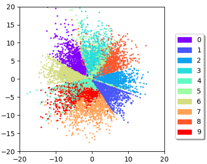

# MAAE

===============================

Multi-adversarial autoencoder appendix

##Archittecture

Experiment Setup
----------------

We apply a convolution architecture on CelebA dataset, as shown below:

| Encoder      | output shape |     Decoder     |     output     |     |
|:-------------|:------------:|:---------------:|:--------------:|:---:|
| InputLayer   |  (32, 32, 3) |    InputLayer   |   (1, 1, 15)   |     |
| conv2d       | (16, 16, 32) |      dense      |  (1, 1, 8192)  |     |
| LeakyReLU    | (16, 16, 32) | conv2dtranspose | ( 16, 16, 128) |     |
| BatchNorm    | (16, 16, 32) |    BatchNorm    |  (16, 16, 128) |     |
| conv2d       |  ( 8, 8, 64) |    LeakyReLU    |  (16, 16, 128) |     |
| LeakyReLU    |  (8, 8, 64)  | conv2dtranspose |  (32, 32, 64)  |     |
| BatchNorm    |  (8, 8, 64)  |    BatchNorm    |  (32, 32, 64)  |     |
| conv2d       |  (4, 4, 128) |    LeakyReLU    |  (32, 32, 64)  |     |
| LeakyReLU    |  (4, 4, 128) | conv2dtranspose |   (32, 32, 3)  |     |
| BatchNorm    |  (4, 4, 128) |                 |                |     |
| flatten      |    (2048)    |                 |                |     |
| dense(mean)  |   (1,1,15)   |                 |                |     |
| dense(stddv) |   (1,1,15)   |                 |                |     |

Stability
---------

Here displays the variance of the objective loss over a sliding time window.
MAAE has a lower standard deviation value than AAE during training,
reaffirming MAAE’s acceleration to steady-state; with *N* = 3 achieves
steady-state almost 2x as fast as AAE (*N* = 1).

Latent Representation Visualization
-----------------------------------

Here is visualization of the 2-dimension hidden representations. An ideal learned manifold that exhibits sharp transitions indicates that
the encoding space is filled and there are no "holes". By observing
that, we found MAAE has a sharper boundary between every two clusters.

‘’‘‘’‘

Style Disentangled
------------------

Besides, we leverage the label information to disentangle style and
content on MNIST

>>>>>>> update code
